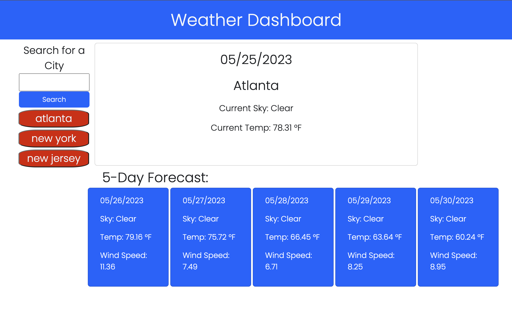
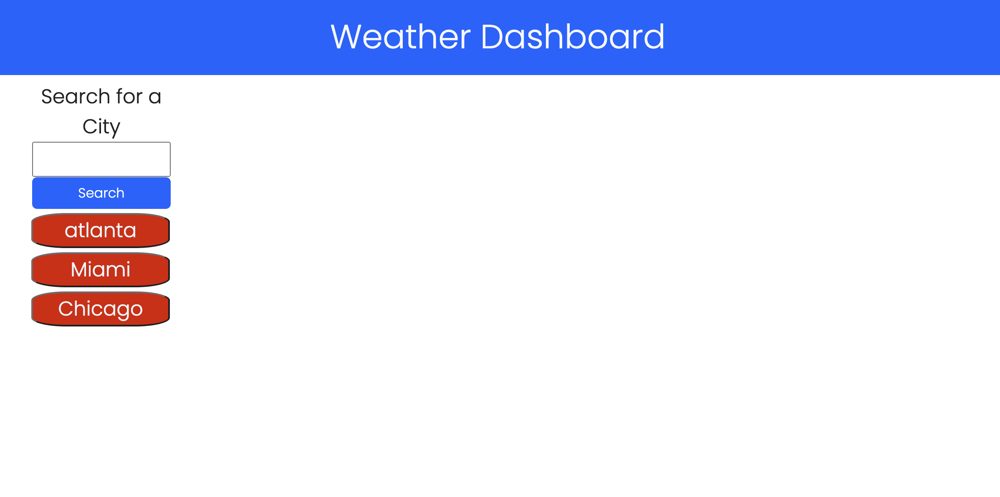

# Weather Dashboard

## Description

As a frequent traveler, I want an app that shows the local weather for multiple cities so that I can plan accordingly.

I learned how to integrate the use of server-side API's into a webpage.

## Usage
Type in a city to display the current and five day weather forecast.  Utilize your recent searches by clicking on the city in the search history to display the weather.  Recent searches will populate upon refresh.

    ```md
    
    ```

## Credits

Thank you to the askBCS team for helping me problem solve a few issues.  
Thank you to my tutor, Sandy Smith, for going over the gist of the project.
Thank you to my tutor, Benicio Lopez, for helping me code lines 37-46 to display the recent city search.
Thank you John Hysong for helping me with javascript lines 42-47 
THank you Gurmeet Singh for helping me understand how to add icons with lines 83-86

## Features

Click on the recent search history to display your most recent cities weather.

https://marbfree.github.io/Weather-Dashboard/





## How to Contribute

Add icons to show when it is sunny, cloudy, or rainy in current and five day forecast.

